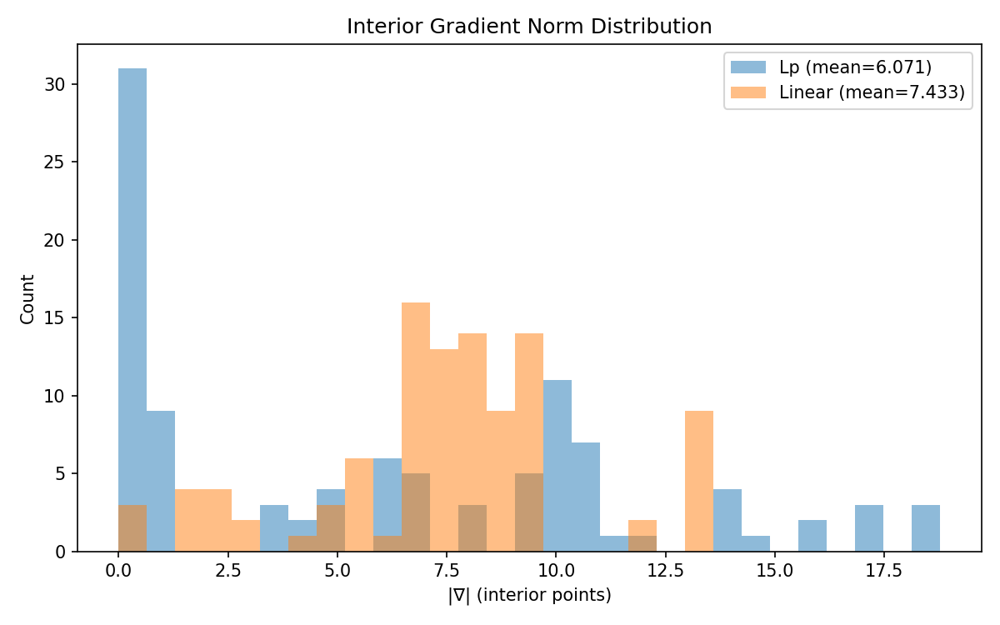
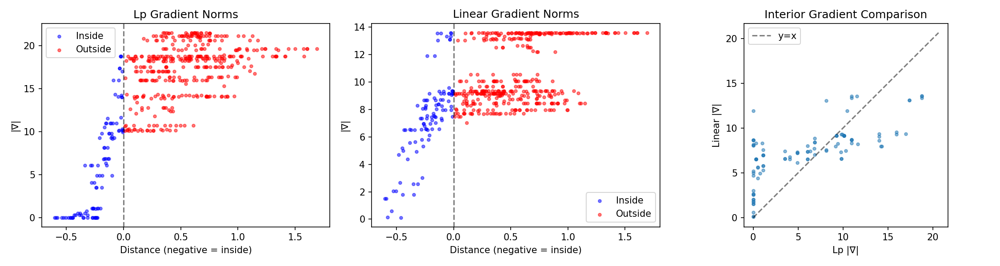
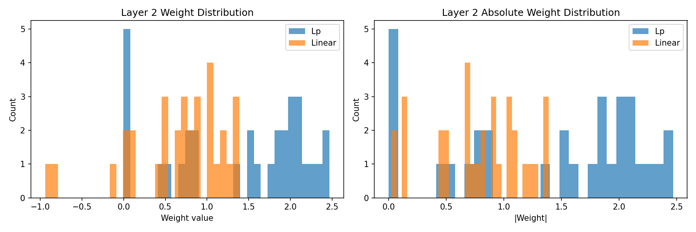

# Interior Gradient Comparison: Lp vs Linear

## Background

The previous experiments established that both Lp and Linear architectures learn distance-like internal representations when trained on polytope membership. However, Lp produces a flatter mesa (lower flatness ratio). 

This experiment directly measures interior gradient norms to test whether the Lp architecture produces genuinely flatter regions—not just statistically similar outputs, but surfaces with near-zero gradients.

## Hypothesis

If Lp produces a true mesa:
- Interior gradient norms should be near zero for deep interior points
- Linear should have non-zero gradients throughout

## Setup

**Architectures:**
```
Lp:     Linear(2, 32) → ReLU → LpNorm(32, 1, p=1) → Linear(1, 1)
Linear: Linear(2, 32) → ReLU → Linear(32, 1) → Linear(1, 1)
```

**Task:** Binary classification—inside vs outside a random convex polytope

**Training:** Adam, lr=1e-3, 200 epochs, seed=0

## Results

### Classification Performance

| Model | Accuracy |
|-------|----------|
| Lp | 99.0% |
| Linear | 99.2% |

Both models learn the task equally well.

### Gradient Norm Statistics

| Region | Lp |∇| | Linear |∇| | Ratio |
|--------|--------|------------|-------|
| Interior | 6.07 | 7.43 | 1.22× |
| Boundary | 14.82 | 9.14 | 0.62× |
| Exterior | 17.80 | 10.79 | 0.61× |

The mean ratio understates the effect.

### The Real Story: Gradient Distribution



**Lp is bimodal:**
- ~31 points with |∇| ≈ 0 (the mesa)
- Remaining points spread from 5-18

**Linear is unimodal:**
- No spike at zero
- All points spread 5-13

| Metric | Lp | Linear |
|--------|-----|--------|
| Points with \|∇\| < 1.0 | 32/101 (31.7%) | 3/101 (3.0%) |

Lp has 10× more flat points.



Left panel shows Lp has a cluster at zero for deep interior points. Middle panel shows Linear has no such cluster.

---

## Analysis: Why Does Lp Produce a Mesa?

### Failed Hypothesis: Negative Weight Cancellation

Initial theory: Linear uses negative weights to cancel activations, destroying the mesa.

Linear had only 3 negative weights out of 32. Flipping them to positive (and negating corresponding layer 1 hyperplanes) produced no change in flat points:

| Model | Flat points |
|-------|-------------|
| Lp | 32 |
| Linear (original) | 3 |
| Linear (flipped) | 3 |

Theory not supported.

### ReLU Activation Analysis

| Region | Lp active % | Linear active % |
|--------|-------------|-----------------|
| Inside | 21.8% | 33.8% |
| Outside | 40.4% | 44.1% |

Lp has fewer active neurons inside, but this is effect, not cause.

### The Answer: Weight Suppression at Center

Examining neurons active at the polytope center:

**Lp Model — Active neurons at center: 4/32**

| Index | Post-ReLU | L2 Weight |
|-------|-----------|-----------|
| 9 | 0.0042 | 0.0317 |
| 10 | 0.4121 | -0.0006 |
| 11 | 0.4849 | -0.0005 |
| 28 | 0.2609 | -0.0017 |

**Linear Model — Active neurons at center: 3/32**

| Index | Post-ReLU | L2 Weight |
|-------|-----------|-----------|
| 11 | 1.5339 | -0.8342 |
| 27 | 0.2359 | 0.0573 |
| 28 | 1.2946 | -0.9420 |

**Summary:**

| Model | Active \|w\| mean | Inactive \|w\| mean |
|-------|------------------|---------------------|
| Lp | **0.0086** | 1.5796 |
| Linear | **0.6112** | 0.7993 |

**70× difference in weights for center-active neurons.**

### The Mechanism

1. Some neurons inevitably fire at the polytope center (random hyperplanes can't all be oriented outward)

2. **Lp constraint:** Output is `Σ|w_i h_i|`. All terms add. To get low output inside, must either silence h_i (ReLU off) or make w_i ≈ 0.

3. **Linear freedom:** Output is `Σ w_i h_i`. Terms can cancel. Can keep w_i large but negative. Output stays low via cancellation.

4. **Gradient consequence:**
   - Lp: Small weight → small gradient → flat region
   - Linear: Large weight (negative) → large gradient → no flat region

### Weight Distribution



| Metric | Lp | Linear |
|--------|-----|--------|
| Min \|w\| | 0.0005 | 0.0234 |
| Weights \|w\| < 0.01 | 4 | 0 |
| Weights \|w\| < 0.1 | 5 | 2 |

Lp learns to suppress some weights to near-zero. Linear doesn't need to—it has cancellation.

---

## Interpretation

**The mesa is real and architectural.**

Lp cannot use signed cancellation, so it must suppress interior-active neurons by driving their weights toward zero. This creates a genuine flat region: where only near-zero weights are active, gradients are near-zero.

Linear can cancel via negative weights, so interior-active neurons retain substantial (but negative) weights. Gradients flow through them. No mesa forms.

**The key insight:**

| Architecture | Strategy for low interior output | Gradient at center |
|--------------|----------------------------------|-------------------|
| Lp | Suppress weights to ≈0 | Near zero |
| Linear | Cancel with negative weights | Non-zero |

Both achieve the same classification. Only Lp achieves the mesa geometry.

## Limitations

- Single seed
- Single polytope configuration
- Didn't test L1 regularization on Linear to force weight suppression
- p=1 only (though p=2 showed similar bimodal structure)

## Next Steps

1. Test L1 regularization on Linear—does forced weight suppression create a mesa?
2. Test non-negative weight constraint during Linear training
3. Multiple seeds for statistical significance

