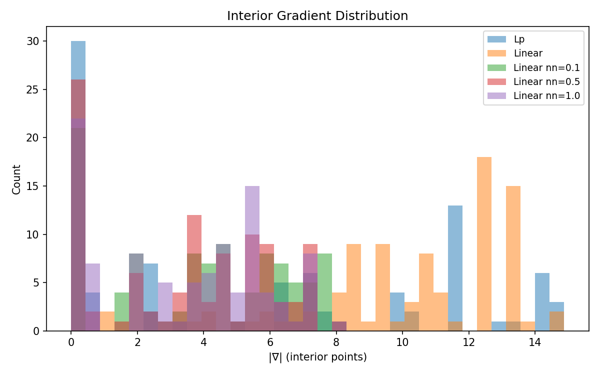
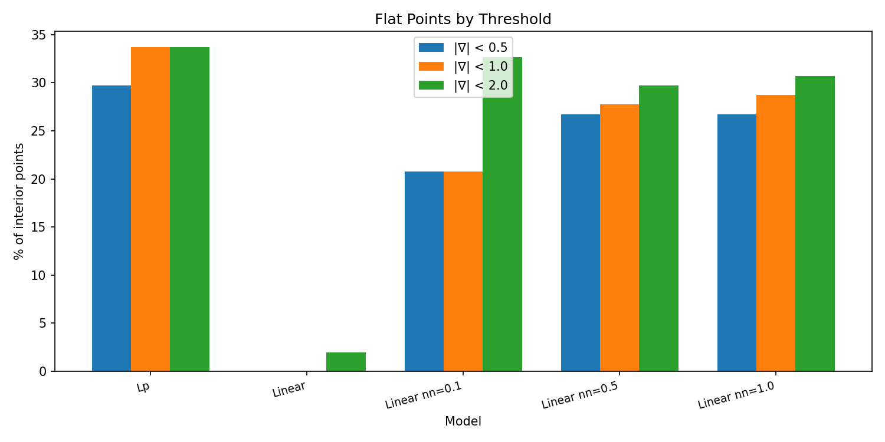
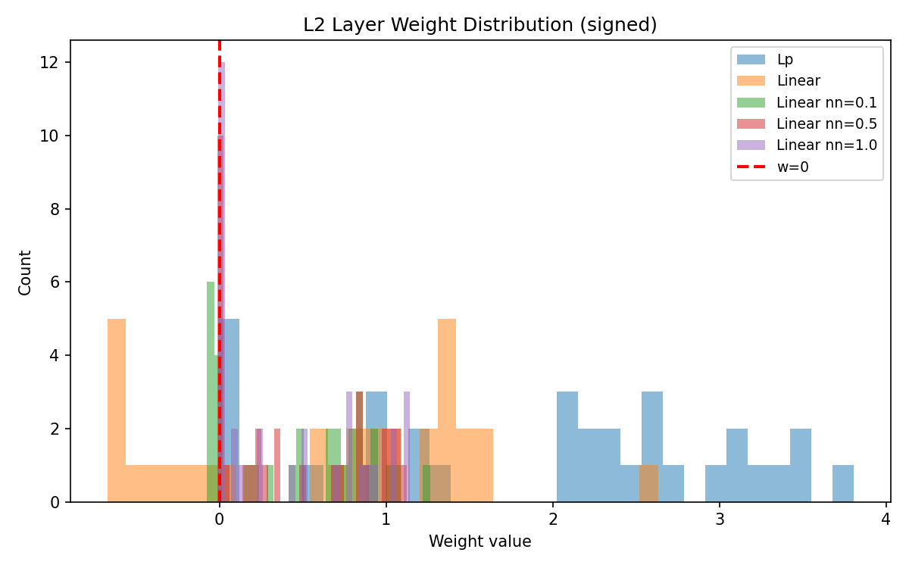
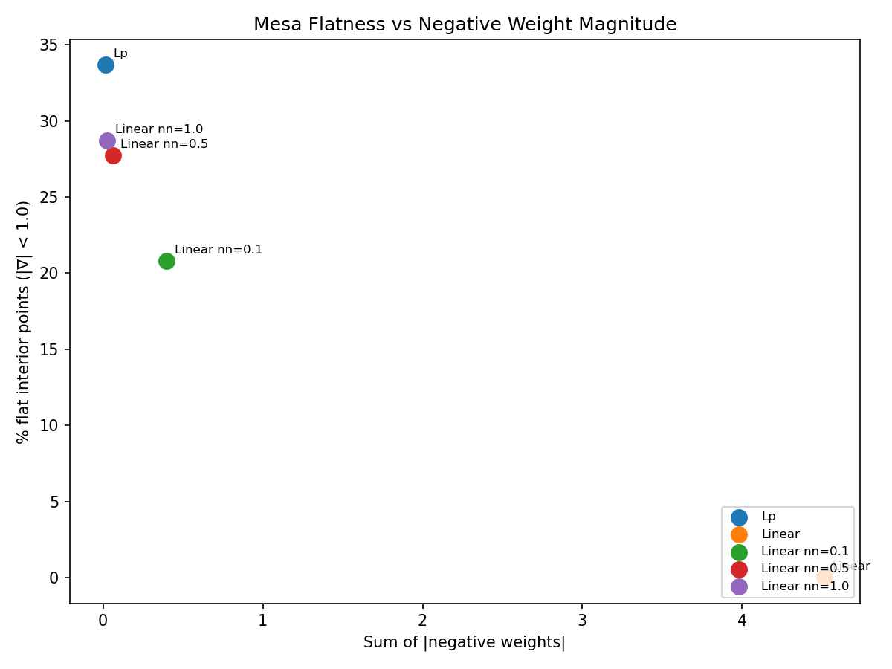

# Non-Negative Weight Constraints for Mesa Structure

## Background

The previous experiment ([exp_gradient_comparison](exp_gradient_comparison.md)) established that the Lp architecture produces mesa structure through a specific mechanism: it suppresses weights on interior-active neurons because it cannot use signed cancellation. Linear models, by contrast, maintain large negative weights that cancel with positive contributions, destroying the mesa.

This raised a question: can we induce mesa structure in Linear models by preventing cancellation?

Two regularization approaches failed:
- **L1 regularization** shrinks all weights toward zero, but doesn't prevent cancellation—small opposite-sign weights can still cancel.
- **L0-style sparsity** encourages weights to be either zero or large, but again doesn't prevent cancellation—the network retains negative weights.

This experiment tests a targeted intervention: penalize only negative weights, leaving positive weights unconstrained. This is the "soft" version of a non-negative constraint, grounded in established theory.

### Theoretical Basis

Lee & Seung (1999) proved that non-negative constraints fundamentally change representation type:
- **Signed weights** → "holistic" representations where features cancel out
- **Non-negative weights** → "parts-based" representations where features only add

Chorowski & Zurada (2015) showed that enforcing w ≥ 0 in neural networks transforms hidden neurons into interpretable, specific feature detectors.

If cancellation is what prevents mesa structure in Linear models, then penalizing negative weights should produce mesa structure similar to Lp.

## Hypothesis

If the mesa mechanism is cancellation prevention:
- Asymmetric penalty on negative weights will reduce cancellation
- Reduced cancellation will increase interior flatness
- Linear with strong non-negative penalty will approach Lp performance

If the mesa requires something beyond non-cancellation:
- Non-negative penalty will not significantly increase flatness
- Lp will remain substantially better than constrained Linear

## Setup

**Architectures:**
```
Lp:     Linear(2, 32) → ReLU → LpNorm(32, 1, p=1) → Linear(1, 1)
Linear: Linear(2, 32) → ReLU → Linear(32, 1) → Linear(1, 1)
```

**Penalty:** Applied only to Linear models' l2 layer weights:
```
loss += λ * Σ relu(-w)²
```
- Negative weights: penalized quadratically, pushed toward zero
- Positive weights: no penalty, free to grow

**Task:** Binary classification—inside vs outside a random convex polytope

**Polytope:** 6 faces, 2D, generated with evenly-spaced normals and random radii

**Data:**
- Train: 2000 points, uniform in [-1.5, 1.5]²
- Test: 500 points, same distribution
- Class balance: ~21% inside (425 train, 101 test)

**Training:**
- Optimizer: Adam, lr=1e-3
- Loss: Binary cross-entropy + non-negative penalty
- Epochs: 500 (with early stopping at 98% accuracy for 50 epochs)
- Penalty strengths: λ ∈ {0.1, 0.5, 1.0}
- Seed: 0

## Results

### Classification Performance

| Model | Accuracy | Final Loss |
|-------|----------|------------|
| Lp | 99.8% | 0.0180 |
| Linear | 99.8% | 0.0162 |
| Linear nn=0.1 | 98.0% | 0.0992 |
| Linear nn=0.5 | 98.2% | 0.0942 |
| Linear nn=1.0 | 98.2% | 0.0933 |

All models achieve >98% accuracy. The task is solved regardless of constraint.

### Mesa Flatness

| Model | |∇| mean | Flat points (<1.0) | Flat % |
|-------|---------|-------------------|--------|
| Lp | 7.84 | 34/101 | 33.7% |
| Linear | 10.78 | 0/101 | 0.0% |
| Linear nn=0.1 | 3.95 | 21/101 | 20.8% |
| Linear nn=0.5 | 3.58 | 28/101 | 27.7% |
| Linear nn=1.0 | 3.47 | 29/101 | 28.7% |

**Key finding:** Linear with non-negative penalty achieves 29 flat points vs Lp's 34—85% of Lp performance. Baseline Linear has 0 flat points.

### Weight Statistics

| Model | w>0 mean | w>0 count | w<0 mean | w<0 count |
|-------|----------|-----------|----------|-----------|
| Lp | 2.2159 | 28 | -0.0041 | 4 |
| Linear | 1.1656 | 22 | **-0.4515** | 10 |
| Linear nn=0.1 | 0.6879 | 23 | -0.0443 | 9 |
| Linear nn=0.5 | 0.6272 | 23 | -0.0068 | 9 |
| Linear nn=1.0 | 0.5862 | 23 | **-0.0029** | 9 |

**Key finding:** The penalty reduces negative weight magnitude from -0.45 (baseline) to -0.003 (λ=1.0)—a 150× reduction. This eliminates cancellation capacity.

---

### Visualizations

**Gradient Histograms:**



*Baseline Linear (orange):* Unimodal distribution centered around 10-11, no mass near zero.

*Linear with non-negative penalty (green/red/purple):* Distributions shift leftward with increasing λ. Mass accumulates near zero, indicating flat interior points.

*Lp (blue):* Bimodal with spike near zero (the mesa) and spread at higher values (boundary/exterior).

The non-negative penalty transforms Linear's gradient distribution toward Lp's characteristic bimodal shape.

**Flat Points by Threshold:**



Bar chart showing percentage of interior points with gradient norm below threshold (0.5, 1.0, 2.0).

Baseline Linear has essentially no flat points at any threshold. With increasing penalty strength, Linear approaches Lp's flatness. At λ=1.0, Linear achieves ~85% of Lp's flat point count.

**Weight Distribution:**



*Baseline Linear:* Weights spread across both positive and negative regions. Substantial negative mass enables cancellation.

*Linear with penalty:* Negative weights compressed toward zero. The distribution becomes increasingly one-sided with higher λ.

*Lp:* All weights effectively non-negative (the small negatives are near-zero). This is enforced architecturally by the absolute value.

**Flatness vs Negative Weight Magnitude:**



Scatter plot showing the direct relationship between negative weight magnitude (x-axis) and mesa flatness (y-axis).

Clear negative correlation: as negative weight sum decreases, flat point percentage increases. This visualizes the causal mechanism—eliminating negative weights eliminates cancellation, which produces the mesa.

---

## Analysis

### The Mechanism Confirmed

The results confirm that **cancellation prevention is both necessary and sufficient** for mesa structure:

| Model | Strategy | w<0 mean | Flat % |
|-------|----------|----------|--------|
| Linear | Cancellation | -0.4515 | 0.0% |
| Linear nn=1.0 | Penalty suppresses negatives | -0.0029 | 28.7% |
| Lp | Architecture prevents cancellation | -0.0041 | 33.7% |

Linear nn=1.0 and Lp have nearly identical negative weight magnitudes (-0.003 vs -0.004) and similar flatness (29% vs 34%). The remaining gap is explained by:

1. **Soft vs hard constraint:** The penalty reduces but doesn't eliminate negative weights. Lp's absolute value provides a hard floor.

2. **Positive weight magnitude:** Lp maintains larger positive weights (mean 2.22 vs 0.59), providing stronger gradient signal outside the polytope while keeping the interior flat.

### Connection to Parts-Based Learning

Lee & Seung (1999) predicted this result. In their framework:

| Representation | Weight Sign | Composition | Interpretation |
|----------------|-------------|-------------|----------------|
| Holistic | Mixed | Features cancel | "What's left over" |
| Parts-based | Non-negative | Features add | "What's present" |

The mesa is the geometric signature of parts-based learning. When features can only add, the prototype region (where all features are satisfied) has constant output. When features can cancel, there is no stable prototype—different cancellation patterns at different locations produce different outputs.

### Why Previous Regularization Failed

| Approach | Effect | Why It Failed |
|----------|--------|---------------|
| L1 | Shrinks all weights | Small opposite-sign weights still cancel |
| L0 | Encourages sparsity | Doesn't distinguish positive from negative |
| Non-negative | Suppresses only negatives | Directly prevents cancellation ✓ |

The key insight: the mesa requires *asymmetric* intervention. Symmetric penalties (L1, L0) treat positive and negative weights equally, preserving the network's ability to cancel. Only asymmetric pressure—penalizing negatives while leaving positives free—eliminates cancellation.

## Interpretation

**The mesa structure is the geometric signature of non-cancellation.**

This experiment completes the causal story:

1. **exp_gradient_comparison:** Lp produces mesa; Linear doesn't. Mechanism: Lp suppresses weights on interior-active neurons because it can't cancel.

2. **L1/L0 experiments:** Symmetric regularization doesn't help. Shrinking or sparsifying weights doesn't prevent cancellation.

3. **This experiment:** Asymmetric penalty on negative weights produces mesa structure in Linear, approaching Lp performance. Cancellation prevention is the causal mechanism.

The PMG framework's claim that ReLU networks compute "distance from prototype regions" is supported, but with an important qualification: **the mesa requires parts-based (non-cancellation) aggregation**. Standard Linear layers with mixed-sign weights compute something else—a holistic representation where the "prototype" is not geometrically meaningful.

## Limitations

- Single seed (n=1)
- Single polytope configuration (6 faces, 2D)
- Soft penalty only—didn't test hard projection (clamping w<0 to 0)
- Didn't test whether mesa structure transfers to downstream tasks
- p=1 only for Lp baseline

## Next Steps

1. **Hard constraint:** Test projected gradient descent (clamp negative weights to zero after each step). Should close the remaining gap to Lp.

2. **Multiple seeds:** Verify consistency of the 85% recovery rate.

3. **Higher dimensions:** Test whether non-negative constraints scale.

4. **Biological connection:** Dale's principle (neurons are either excitatory or inhibitory) may relate to why biological networks develop interpretable representations.

5. **Interpretability applications:** If non-negative constraints produce parts-based representations, they may improve feature interpretability in larger networks.