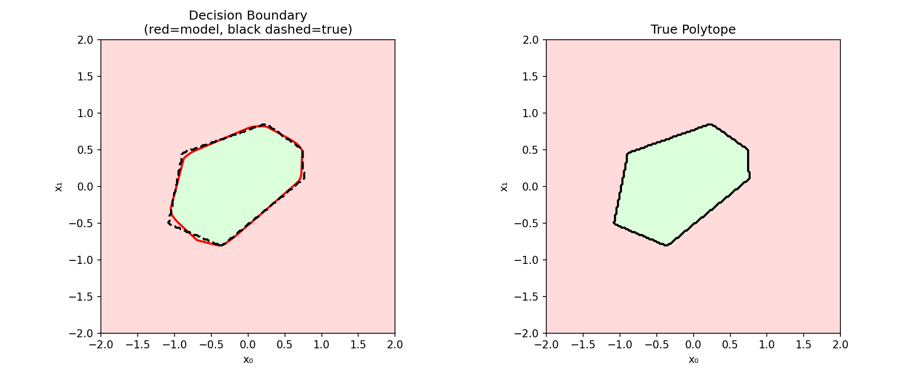
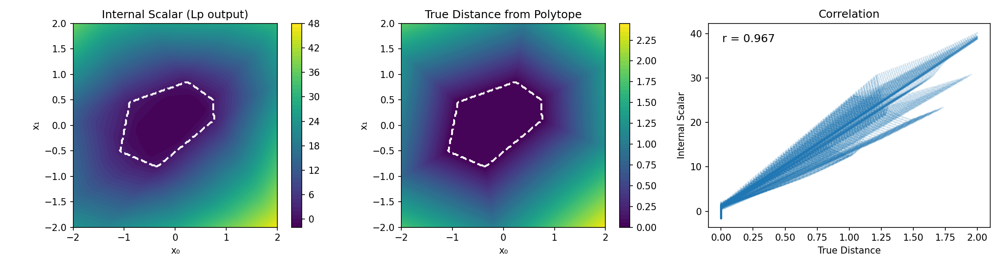
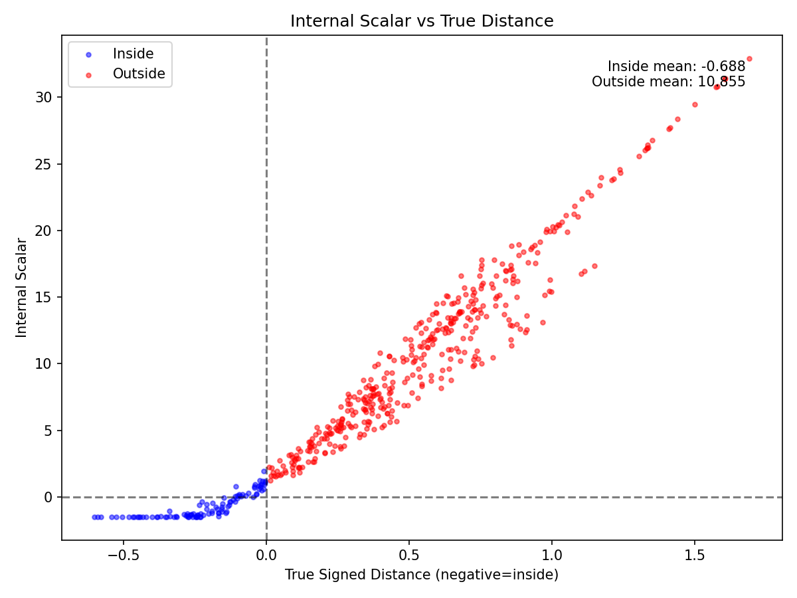

# Mesa Structure Verification: Linear Baseline

## Background

The previous experiment established that a `Linear → ReLU → Lp → Linear` architecture learns mesa structure when trained on polytope membership classification. The internal scalar correlates strongly with true distance (r = 0.963) and shows a flat interior.

This experiment tests whether mesa structure is specific to the Lp architecture or emerges from any classifier trained on this task.

## Hypothesis

If mesa structure is architecture-induced:
- Linear aggregation will not produce flat interiors or distance correlation

If mesa structure is task-induced:
- Linear aggregation will produce similar structure to Lp

## Setup

**Architecture:**
```
Linear(2, 32) → ReLU → Linear(32, 1) → Linear(1, 1)
```

Identical to the Lp experiment except the Lp layer is replaced with a standard linear layer.

**Task:** Binary classification—inside vs outside a random convex polytope

**Polytope:** 6 faces, 2D, same random seed as Lp experiment

**Data:**
- Train: 2000 points, uniform in [-1.5, 1.5]²
- Test: 500 points, same distribution

**Training:**
- Optimizer: Adam, lr=1e-3
- Loss: Binary cross-entropy
- Epochs: 200
- Seed: 0

## Results

### Classification Performance

| Metric | Train | Test |
|--------|-------|------|
| Accuracy | 99.2% | 99.2% |
| Loss | 0.062 | 0.061 |

### Internal Scalar Statistics

| Region | Mean | Std |
|--------|------|-----|
| Inside polytope | -1.19 | 1.25 |
| Outside polytope | 5.98 | 3.49 |

### Mesa Assessment

| Metric | Value |
|--------|-------|
| Inside std | 1.252 |
| Separation | 7.17 |
| Flatness ratio | 0.175 |
| Correlation | 0.979 |

### Comparison with Lp Architectures

| Metric | Lp (p=1) | Lp (p=2) | Linear |
|--------|----------|----------|--------|
| Test accuracy | 99.0% | 98.2% | 99.2% |
| Inside std | 0.916 | 0.75 | 1.252 |
| Separation | 11.54 | 6.5 | 7.17 |
| Flatness ratio | **0.079** | 0.115 | 0.175 |
| Correlation | 0.968 | 0.963 | **0.979** |

---

### Visualizations

**Decision Boundary:**



Model boundary closely tracks true polytope. Visually indistinguishable from Lp result.

**Internal Scalar Surface:**



*Left panel:* Internal scalar shows mesa structure—low values inside, gradient outside.

*Center panel:* True distance for comparison.

*Right panel:* Correlation r = 0.979, slightly higher than Lp (0.963).

**Internal Scalar vs True Distance:**



Inside points (blue) cluster at low values. Outside points (red) show linear relationship with true distance. The transition at x = 0 is clear but less sharp than Lp.

---

## Interpretation

**Mesa structure is task-induced, not architecture-specific.**

The linear baseline learns distance-like geometry comparable to Lp:
- High correlation with true distance (r = 0.979)
- Clear separation between inside and outside
- Visually similar mesa structure

**The architectures differ in character:**

| Property | Linear | Lp |
|----------|--------|-----|
| Correlation with ground truth | Higher (0.979) | Lower (0.963–0.968) |
| Interior flatness | Lower (ratio 0.175) | Higher (ratio 0.079–0.115) |
| Matches L∞ structure | Better | Smoother approximation |

Linear aggregation can produce negative outputs (cancellation between positive and negative weights). This allows it to track the L∞-like ground truth more precisely. But it permits more variance inside the polytope.

Lp aggregation is strictly non-negative (absolute values). It enforces a floor, producing flatter interiors but smoother (less faceted) distance estimates.

**The PMG interpretation holds for both architectures.** Standard ReLU networks learn distance-from-polytope structure when trained on polytope membership. The Lp layer is not required—but it produces cleaner mesa geometry.

## Conclusion

Mesa structure emerges from the classification task, not from architectural constraints. Any network that learns to separate inside from outside will develop distance-like internal representations.

The Lp layer's contribution is *refinement*: flatter interiors, sharper transitions, more uniform prototype regions. L1 aggregation produces the flattest mesa (ratio 0.079), supporting the intuition that integrating all face violations democratically produces cleaner prototypes.

For applications requiring interpretable prototype regions, Lp (especially p=1) offers advantages. For pure classification or faithful distance estimation, linear aggregation is equally effective.

## Limitations

- Single seed (n=1)
- Single polytope configuration
- 2D only
- Linear baseline has different parameter count than Lp (bias in aggregation layer)

## Next Steps

1. Multiple seeds for statistical significance
2. Higher dimensions
3. More complex polytopes (more faces)
4. Test whether Lp advantage persists on harder tasks

