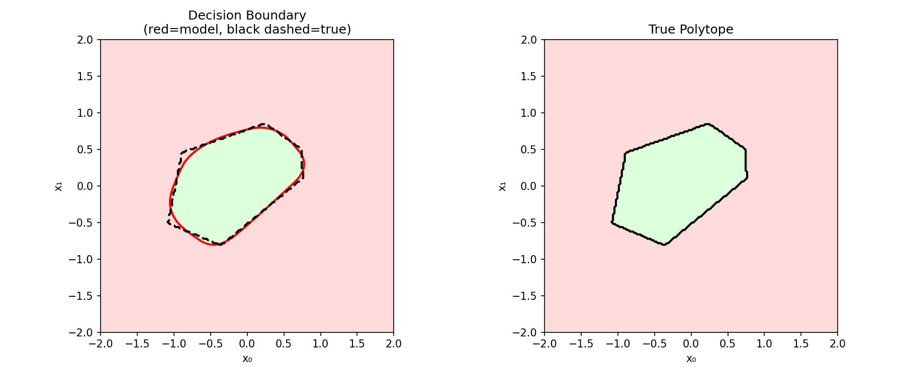
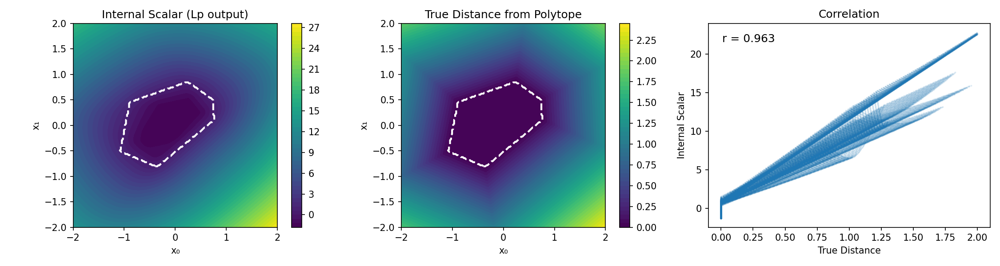
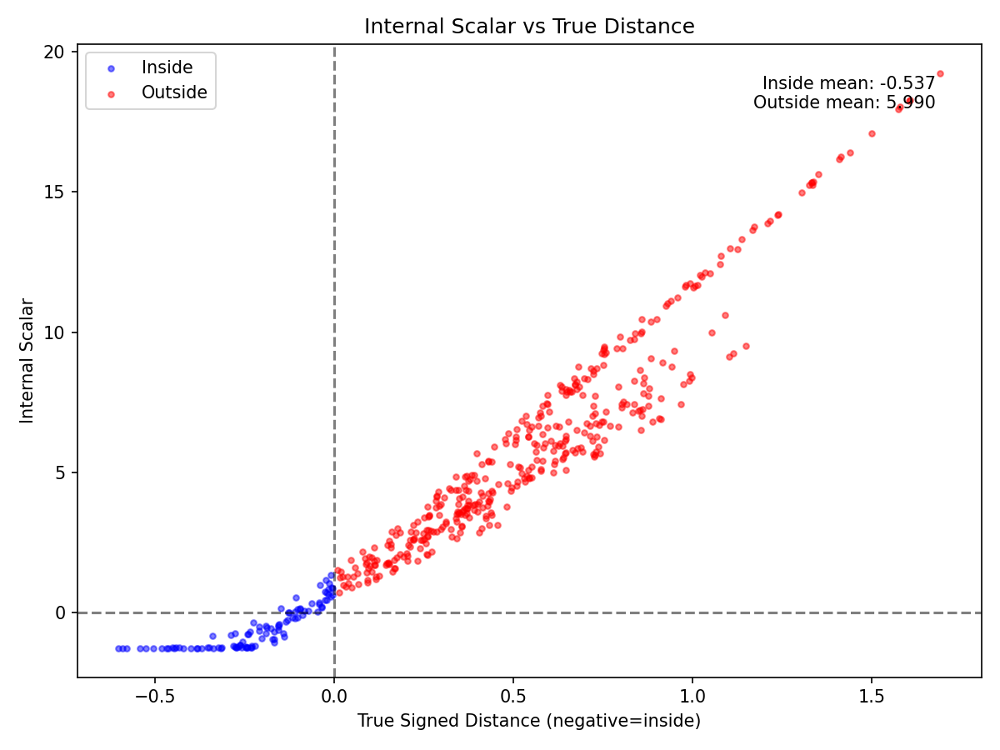

# Mesa Structure Verification

## Background

The Polyhedral Mesa Gaussian (PMG) framework proposes that ReLU networks implicitly compute distance from prototype regions. In this interpretation:

- **Linear layer:** defines hyperplanes (faces of a polytope)
- **ReLU:** computes one-sided distance (zero inside, positive outside)
- **Aggregation:** combines face violations into total distance

The "mesa" is the region where distance is zero—the interior of the polytope. If this interpretation holds, a network trained only for classification should learn distance-like structure as a byproduct.

## Hypothesis

A network with architecture `Linear → ReLU → LpNorm → Linear`, trained on polytope membership classification, will learn an internal representation where:

1. Internal scalar (Lp output) is approximately constant inside the polytope
2. Internal scalar increases with distance outside the polytope
3. Decision boundary aligns with the true polytope boundary

## Setup

**Architecture:**
```
Linear(2, 32) → ReLU → LpNormLayer(32, 1, p=2) → Linear(1, 1)
```

**Task:** Binary classification—inside vs outside a random convex polytope

**Polytope:** 6 faces, 2D, generated with evenly-spaced normals and random radii (0.4–1.0)

**Data:**
- Train: 2000 points, uniform in [-1.5, 1.5]²
- Test: 500 points, same distribution
- Class balance: ~21% inside (425 train, 101 test)

**Training:**
- Optimizer: Adam, lr=1e-3
- Loss: Binary cross-entropy
- Epochs: 200
- Seed: 0

## Results

### Classification Performance

| Metric | Train | Test |
|--------|-------|------|
| Accuracy | 98.7% | 98.2% |
| Loss | 0.078 | 0.076 |

### Internal Scalar Statistics

| Region | Mean | Std |
|--------|------|-----|
| Inside polytope | -0.54 | 0.75 |
| Outside polytope | 5.99 | 3.65 |

Separation: 6.53

### Correlation with True Distance

Pearson r = 0.963

---

### Visualizations

**Decision Boundary:**



Left panel: Model's decision boundary (red) overlaid with true polytope boundary (black dashed). Green region is classified as "inside," pink as "outside." Right panel: True polytope for reference.

The learned boundary closely tracks the true polytope. Minor smoothing at corners is expected—the Lp norm produces curved contours rather than sharp vertices.

**Internal Scalar Surface:**



Three panels showing the relationship between learned representation and true geometry.

*Left panel:* The Lp layer output across the input space. Dark purple region inside the polytope indicates low/constant values (the mesa). Color gradient outside shows increasing values with distance from boundary. The white dashed line marks the true polytope boundary.

*Center panel:* True distance from polytope boundary (computed as max(0, -min_face_slack)). Same color scale logic—zero inside, increasing outside. Note the different scale (0–2.5) compared to internal scalar (0–27); the network amplifies distance.

*Note on faceted structure:* The true distance shows visible rays emanating from polytope corners. This is because min-face-slack measures distance to the *nearest face*, not Euclidean distance to the boundary. Each angular region is dominated by a single face, creating a piecewise-linear distance field with discontinuous gradients at the boundaries between regions. This is an L∞ Norm distance.

*Right panel:* Correlation between the two surfaces. Each point represents one location in the grid. The tight linear relationship (r = 0.963) confirms the internal scalar tracks true distance, not just classification.

The correlation plot (right panel) reflects the faceted structure of the true distance—the multiple "rays" correspond to different faces dominating the distance calculation. The network's internal scalar is smoother, suggesting the Lp aggregation blends contributions from multiple faces rather than taking a hard minimum.

**Internal Scalar vs True Distance (Test Points):**



Scatter plot of internal scalar against true signed distance for 500 test points. Negative x-values indicate points inside the polytope; positive x-values indicate outside.

*Blue points (inside):* Cluster tightly in the lower-left. Low variance (std = 0.75) confirms the mesa—the network outputs approximately constant values throughout the polytope interior, regardless of position.

*Red points (outside):* Form a clear linear trend. Points further from the boundary produce proportionally larger internal scalar values. The spread at larger distances reflects that min-face-slack measures distance to nearest face, while the network may weight faces differently.

*Key observation:* The transition at x = 0 is sharp. Inside points cluster; outside points disperse along a line. This is the mesa structure: flat interior, ramped exterior.

## Interpretation

**Mesa structure confirmed.** The network learns:

1. **Flat interior:** Inside points cluster tightly (std = 0.75) around a constant value
2. **Distance-like exterior:** Internal scalar increases linearly with true distance (r = 0.963)
3. **Accurate boundary:** Decision boundary matches true polytope

This supports the PMG interpretation: the Lp architecture induces distance computation even when trained only for classification. The internal scalar behaves like a distance function with a plateau inside the polytope.

**Norm equivalence:** The ground truth distance (`min_face_slack`) is effectively an L∞ metric—it returns the most violated constraint, producing the faceted structure visible in the center panel of the internal surface plot. The network learns an L2 aggregation, which blends violations smoothly.

Despite computing fundamentally different metrics, correlation remains high (r = 0.963). This is expected from norm equivalence: in finite dimensions, all norms preserve relative ordering even when absolute values differ. Classification requires only that "further from boundary" maps to "higher internal scalar"—not that the exact distance is recovered. The Lp architecture satisfies this weaker requirement while producing smoother, more interpretable geometry.

## Limitations

- Single seed (n=1)
- Single polytope configuration (6 faces, 2D)
- Single p value (p=2)
- "True distance" is min-face-slack, not Euclidean distance

## Next Steps

1. Run multiple seeds to verify consistency
2. Compare to MLP baseline—does standard architecture also learn mesa structure?
3. Vary p (1, 2, ∞) and number of faces
4. Test in higher dimensions
