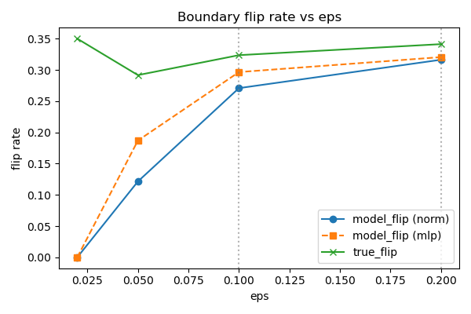
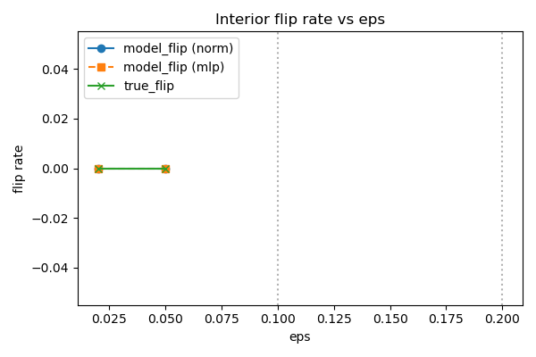
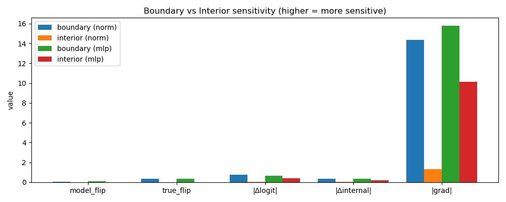
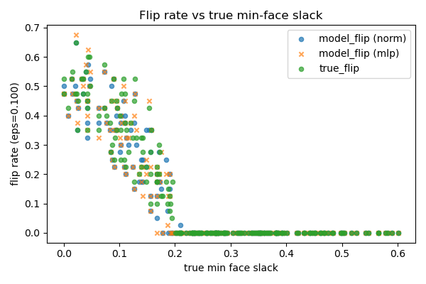
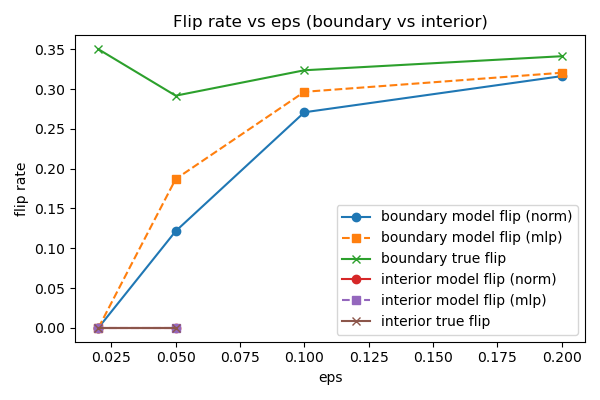

# Experiment: Polytope Boundary Sensitivity

**Norm-Aggregated Model vs Matched MLP Baseline**

---

## 1. Purpose

This experiment evaluates whether **norm aggregation** in a ReLU network introduces a distinct geometric inductive bias compared to a standard Linear–ReLU–Linear MLP.

Specifically, it tests whether the norm-aggregated model learns:

* a **flat interior (plateau)** inside a polytope, and
* **sensitivity localized near true constraint boundaries**,

as opposed to the smoother, globally sensitive behavior typically associated with MLPs.

The experiment is **behavioral**, not performance-oriented. Both models achieve comparable accuracy; the question is whether they represent the solution space differently.

---

## 2. Task and Geometry

The task is binary classification of membership in a randomly generated **convex polytope** in $\mathbb{R}^2$, defined by linear half-space constraints:

$$
n_i^\top x \le r_i
$$

Ground-truth geometry is fully known, including:

* exact polytope membership
* true minimum face slack (distance to the nearest boundary along constraint normals)

This enables direct alignment between **model behavior** and **true geometry**—we can measure not just whether models get the right answer, but whether their internal representations reflect the underlying geometric structure.

---

## 3. Models Compared

### 3.1 Norm-Aggregation Model

```
x → Linear → ReLU → NormAggregation (learnable p) → Linear (head) → logit
```

* ReLU activations represent constraint violations.
* Norm aggregation produces a **scalar, distance-like quantity**.
* The norm parameter $p$ is learned jointly with weights.

During training, $p$ evolves from its initialization ($p = 2.0$) to approximately $p \approx 1.25$, suggesting the model finds an intermediate norm between L1 and L2 most useful for this task.

---

### 3.2 Matched MLP Baseline

```
x → Linear → ReLU → LinearAggregation → Linear (head) → logit
```

* Same depth and number of ReLU stages.
* Aggregation is a learned weighted sum (no norm structure).
* Same scalar bottleneck before the output head.

This baseline isolates the effect of **aggregation geometry** while holding architectural complexity constant. Any behavioral differences can be attributed to the norm operation itself.

---

## 4. Training

Both models are trained with identical settings:

| Parameter | Value |
|-----------|-------|
| Optimizer | Adam |
| Learning rate | 1e-3 |
| Epochs | 200 |
| Random seed | matched |

**Final training loss:**

| Model | Loss |
|-------|------|
| Norm-aggregated | ≈ 0.033 |
| MLP baseline | ≈ 0.032 |

Both models fit the task equally well—this is critical, as it means any behavioral differences are not due to one model learning the task better than the other.

---

## 5. Boundary Sensitivity Probe

### 5.1 Probe Definition

The core hypothesis is that norm aggregation creates mesa-like geometry: flat interiors with sharp boundaries. To test this, we probe how each model responds to small perturbations at different distances from the true polytope boundary.

**Procedure:**

1. Sample test points uniformly.
2. Restrict to points inside the **true polytope**.
3. Partition points into:
   * **Boundary**: small true slack (close to an edge)
   * **Interior**: large true slack (deep inside the polytope)
4. Apply isotropic perturbations:
   $$
   x' = x + \epsilon \cdot \frac{u}{|u|}
   $$
   where $u$ is a random direction vector.
5. Measure sensitivity via:
   * `model_flip`: fraction of perturbations flipping the model prediction
   * `true_flip`: fraction crossing the true boundary
   * mean $|\Delta\text{logit}|$: how much the output changes
   * mean $|\Delta\text{internal}|$: how much the internal representation changes
   * mean $|\nabla_x \text{logit}|$: gradient magnitude (local sensitivity)

**Perturbation magnitudes tested:**

$$
\epsilon \in \{0.02, 0.05, 0.10, 0.20\}
$$

Interior statistics are reported only when sufficient interior probes exist.

---

## 6. Results

### 6.1 Boundary Behavior

Both models exhibit similar boundary behavior:

* Boundary flip rates increase with $\epsilon$.
* Model flips track true flips.
* Boundary gradients and output changes are large.

This indicates that **both architectures learn the boundary geometry**. The difference lies in what happens away from the boundary.



*Both models track the true boundary flip rate, confirming they have learned the correct decision boundary.*

---

### 6.2 Interior Behavior (Key Result)

Interior behavior differs sharply between the two architectures.

#### $\epsilon$ = 0.02

| Metric | Norm Model | MLP | Ratio (MLP/Norm) |
|--------|------------|-----|------------------|
| $\|\Delta\text{logit}\|$ | 0.067 | 0.264 | 3.9× |
| $\|\Delta\text{internal}\|$ | 0.029 | 0.142 | 4.9× |
| $\|\nabla\|$ | 2.28 | 11.21 | 4.9× |

#### $\epsilon$ = 0.05

| Metric | Norm Model | MLP | Ratio (MLP/Norm) |
|--------|------------|-----|------------------|
| $\|\Delta\text{logit}\|$ | 0.028 | 0.530 | 18.9× |
| $\|\Delta\text{internal}\|$ | 0.012 | 0.284 | 23.7× |
| $\|\nabla\|$ | 0.31 | 9.04 | 29.2× |

Despite identical **zero flip rates** in the interior, the MLP shows **order-of-magnitude larger interior sensitivity**. The norm model's interior is genuinely flat; the MLP's is smooth but sloped.



*Both models achieve zero interior flips, but this masks a fundamental difference in their internal geometry.*

---

### 6.3 Aggregate Interior Comparison

Mean over $\epsilon$ values with valid interior probes ($\epsilon$ = 0.02, 0.05):

| Metric | Norm Model | MLP | Ratio (MLP/Norm) |
|--------|------------|-----|------------------|
| $\|\Delta\text{logit}\|$ | 0.047 | 0.397 | 8.4× |
| $\|\Delta\text{internal}\|$ | 0.020 | 0.213 | 10.7× |
| $\|\nabla\|$ | 1.30 | 10.13 | 7.8× |

The norm model learns a **genuinely flat interior**, while the MLP remains smooth but sensitive throughout.



*Summary comparison showing the stark contrast in interior sensitivity between architectures.*

---

### 6.4 Sensitivity vs Distance from Boundary

The relationship between flip rate and distance from the true boundary reveals the spatial structure of each model's learned representation.



*Flip rate as a function of true min-face slack. The norm model's sensitivity drops off more sharply as we move away from the boundary.*



*Overall flip rates across perturbation magnitudes for both boundary and interior regions.*

---

## 7. Interpretation

The results support three conclusions:

### 1. Boundary geometry is task-driven

Both models learn where the boundary is. This is expected—the training signal comes from the classification task, which requires correctly identifying the boundary.

### 2. Interior geometry is architecture-driven

The key finding: **norm aggregation produces a flat plateau in the interior, while the MLP does not**.

This is not because the MLP fails to learn the task—both models achieve the same accuracy. Rather, it reflects a fundamental difference in how the two architectures represent the solution:

* **Norm model**: Computes something akin to distance-to-boundary, which saturates (becomes flat) deep inside the polytope.
* **MLP**: Learns a smooth function that happens to cross zero at the boundary, but continues to vary throughout the interior.

### 3. Flip rates alone are insufficient

Both models achieve zero interior flips at small $\epsilon$. If we only measured flip rates, we would conclude the models behave identically.

Only gradient- and magnitude-based probes reveal the difference. This highlights the importance of probing internal representations, not just input-output behavior.

---

## 8. Conclusion

In a controlled polytope setting:

* Norm-aggregated ReLU networks learn distance-like representations with robust interiors.
* A matched Linear–ReLU–Linear MLP achieves the same accuracy but lacks interior flatness.
* The plateau–boundary geometry is attributable to **norm aggregation**, not generic ReLU structure.

Norm aggregation therefore induces a **mesa-like representation**: flat interior, sharp boundary. This establishes norm aggregation as a meaningful geometric inductive bias with potential implications for robustness and interpretability.

---

## 9. Status

This experiment is **complete**.

No further sweeps or refinements are required to support the stated conclusions.
